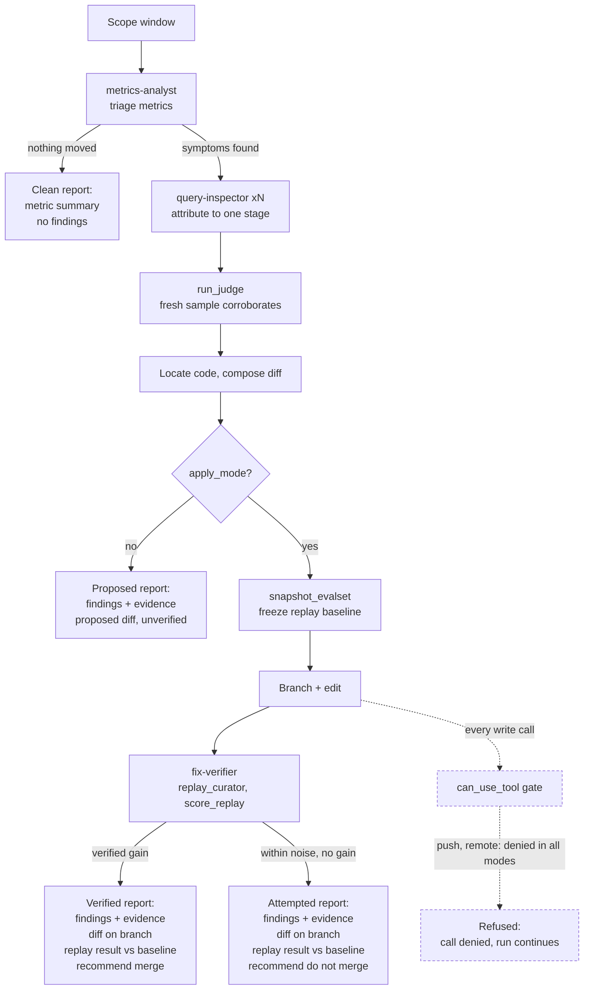

# Investigator Agent — Design Note

| | |
|---|---|
| **Status** | Implemented. Read-only by default; Branching, implementation, and verification gated by `--apply`. |
| **Last reviewed** | 2026-08-06 |
| **Owner** | jj-tsao |
| **Code** | `packages/python/reelix_eval/agent/` — `run.py` (assembly, safety gate), `tools.py`, `subagents.py`, `prompts.py` |
| | `packages/python/reelix_eval/` — `judge/`, `replay/`, `store.py`, `metrics.py`, `report.py` |
| **Entry point** | `apps/jobs/jobs/investigate.py` |
| **Run** | `python -m jobs.investigate --since 7d` |

> Reelix's runtime agent architecture (Orchestrator → Retrieval → Curator → Reflection → Explanation) is in the [root README](https://github.com/jj-tsao/reelix-ai/blob/main/README.md). This note covers only the agentic layer that evaluates and investigates the production logs.

---

## Summary

The Investigator Agent (built on Claude Agent SDK) reads Reelix's own production logs, attributes a quality regression to a specific stage of the recommendation pipeline, proposes a concrete diff; and, when `apply_mode` is enabled, it branches, implements the fix, and verifies it by replaying a frozen eval set. Finally, the agent writes a report with findings and verified solutions for human review and approval.

Observability is done separately: OpenTelemetry and Grafana for live traces, batch metrics and LLM-as-a-judge evals for daily aggregates (`jobs.eval_judge`). The Investigator's main job is root-cause attribution, solutioning, and verification: **which stage caused it, on the evidence of which specific queries, and what change would fix it — then testing that change against a frozen baseline and handing the human a diff for approval.**

---

## What problem does it solve?

Reelix has two existing evaluation layers. The batched **LLM-as-a-judge eval** (`jobs.eval_judge`) samples completed queries and scores them on relevance, novelty, spec fidelity, list coherence, and explanation quality. **Distributed tracing (OTel)** gives per-request stage timing and metadata. Together they are sufficient for detection but inefficient for diagnosis. 

Investigating a regression means a human reading query logs and traces, attributing the root cause to a pipeline stage, composing a candidate fix, and verifying it by hand. 1–2 hours of effort per regression.

The Investigator Agent makes investigation a repeatable, autonomous job. The key challenge is designing the harness layer that constrains the agent to:

1. Ground findings in real production evidence
2. Attribute root causes to a single pipeline stage
3. Propose fixes with measurable, verified outcomes

---

## Architecture

A lead agent (`claude-opus-5`, 60-turn ceiling) plus three context-isolated subagents (`metrics-analyst`, `query-inspector`, `fix-verifier`), over ten in-process MCP tools.

```
                        ┌────────────────────────────────────────┐
   jobs.investigate ───▶│  Investigator (lead)                   │
                        │  scope · locate/compose code · report  │
                        └───────┬───────────┬────────────┬───────┘
                                │           │            │
                      ┌─────────▼───┐ ┌─────▼───────┐ ┌──▼──────────┐
                      │ metrics-    │ │ query-      │ │ fix-verifier│
                      │ analyst     │ │ inspector   │ │             │
                      │ What moved? │ │ Why?        │ │ Did it help?│
                      └─────────────┘ └─────────────┘ └─────────────┘
                              │             │            │
                           ┌──▼─────────────▼────────────▼───┐
                           │  mcp__reelix_eval__*  (10 tools)│
                           │  Supabase logs · judge · replay │
                           └─────────────────────────────────┘
```

**Agent Workflow** 



**Why subagents?** 
* Measured tool output: `get_query_detail` **~2.5k each**. A `query-inspector` reading ten queries absorbs ~25k tokens of raw material. Accumulating it in the lead's window would crowd out the reasoning that needs the room. 
* The `metrics-analyst` split is *not* about size (`compare_windows` at 1.4k is negligible), and more about ownership: its ranked shortlist is a judgement call, and the lead should receive that independent judgement rather than forming its own from the same numbers. 
* The same ownership consideration goes to `fix-verifier`: replaying and verifying fixes needs to be a standalone judgement. Only the conclusions are reported back to the lead.

---

## Key design decisions

| Decision | Alternative | Why |
|---|---|---|
| The production system under test stays on OpenAI; the eval layer runs on Claude | Single model provider | Judge and curator sharing a model family means sharing blind spots. Cross-provider evaluation keeps the two independent, and lets each side pick per role (`gpt-4.1-mini` for latency-sensitive serving, `claude-sonnet-5` for eval judgements, `claude-opus-5` for Investigator reasoning). Curator replay still calls OpenAI, since the replay must reproduce the system as it actually runs.
| **Sonnet 5** as default eval judge, chosen by A/B against Opus 5. **Opus 5** handles the agent's core reasoning. | Opus 5 everywhere; or Haiku 4.5 for cost | Sonnet tracks Opus closely enough to trust (r=0.81 on relevance, 95% of items within one point, identical `spec_violation` calls) at ~30% of the cost. Haiku 4.5 was rejected: novelty correlation drops to 0.52 and it grades systematically easier. Opus is retained as a periodic recalibration reference. |
| The eval judge calls Claude's Messages API directly from an in-process tool, while the Investigator agent runs on Claude Agent SDK | Delegate judging to a subagent | An eval score has to be a typed row in `judge_evaluations`, not prose. `messages.parse()` validates against the pydantic schema before the result is returned; a subagent would return free text that needs re-parsing, with no guarantee it holds the rubric's shape. The same code path then serves both the agent's `run_judge tool` and the batch `jobs.eval_judge` with no agent involved. Running in-process also means the call bills to `REELIX_JUDGE_ANTHROPIC_KEY`, keeping judge spend separate and measurable from agent spend.
| Write tools **never** listed in `allowed_tools`, in either mode | List `Edit`/`Write`/`Bash` under `--apply` | Listing a tool there auto-approves it *before* `can_use_tool` runs — silently bypassing the entire guard, including the unconditional push denial. Omitting them forces every call through the callback. The SDK raises `CanUseToolShadowedWarning` if this regresses. |
| Judge uses structured outputs with `Literal[1..5]` scores | Bare `json.loads` with a fallback | The v1.0 judge silently fell back to `{}` on a malformed response, scoring every candidate `None` — which in aggregate looked exactly like a quality regression. `Literal` rather than `Field(ge=…, le=…)` because structured outputs enforce `enum` server-side but strip numeric constraints. |
| Judge key is `REELIX_JUDGE_ANTHROPIC_KEY` | Reuse `ANTHROPIC_API_KEY` | That name resolves first for both the Anthropic SDK and the Claude Code CLI, so exporting it would silently move every agent turn off plan credit onto pay-as-you-go. Preflight *fails the run* if it's set. |
| Two independent judge calls; recommendation quality judged **blind** to the "why" text | One call scoring everything | A persuasive explanation must not be able to rescue a bad pick. Relevance drops → curator. Explanation quality drops → explanation agent. Stage attribution again. |
| Batch API for `jobs.eval_judge`, synchronous for the agent's `run_judge` | One path for both | Batch is half price ($0.0195 vs $0.0380 per query) but takes minutes. The batch job can wait (not time-sensitive); an agent mid-investigation is low volume but time-sensitive. |
| Tools run **in-process**, not in the SDK subprocess | Separate MCP server | Anything a tool calls is billed to that code's own credential. Deliberate for `run_judge`: judge spend stays separate and measurable from agent spend. |
| `compare_windows` aggregates **live** from the logging tables | Read `daily_metrics` | `daily_metrics` is only written when the batch job runs. Live aggregation allows a comparison to run on any window without depending on a job having run. |
| `setting_sources=[]` | Inherit `~/.claude` and repo settings | A run's configuration is explicit. Unrelated local config cannot silently change what an investigation is allowed to do. |
| Noise floor stated in the prompt as numbers | Leave it to judgement | The curator runs at `temperature=0.1`, so an *unchanged* replay reproduces only ~0.80 served overlap and tier counts wander ±0.25 run to run. The prompt gives the agent the threshold: under ~0.3 on a 1–5 axis, say "within noise" and mean it. |
| No prompt caching on judge rubrics | Pad the rubrics past the cacheable minimum | Both system prompts sit below it (rec 920 / expl 400 tokens; Sonnet 5 needs 1024). Verified no-op: repeated calls report zero cache reads. Padding a rubric with filler would save ~$0.37/month and make the prompt worse. |

---

## Evidence Standards

Encoded in the agent prompt as standards that explicitly outrank completing the workflow.

**Evidence is query IDs and numbers.** Every claim names the queries it rests on. A hypothesis that couldn't be checked against real queries is labelled low-confidence, not stated as fact.

**Attribute to a stage.** Bad candidates scored accurately is a retrieval issue. Good candidates scored wrongly is the curator. A spec that lost the user's intent is the orchestrator. Every finding picks one.

**A clean run is a valid result.** If nothing is wrong, the agent says so in one line and writes a report with no findings. The prompt forbids manufacturing findings to justify the run — the likeliest way an agent like this fails is by rewarding itself for output.

**Weak evidence stays weak.** Label it low-confidence. Don't drop it, don't inflate it.

**Look for the disconfirming case.** A subagent claiming the curator over-scores thrillers must also find a thriller it scored correctly, and report that too.


---

## Safety and trust model

The agent's commit rights are fenced in layers:

- **Read-only by default.** `Edit`, `Write`, and `Bash` sit in `disallowed_tools` — not merely denied per call, but uninvokable.
- **`--apply` opens edits, never the remote.** `push`, `remote`, `fetch`, `pull`, `clone`, and `submodule` are denied unconditionally, in every mode. Publishing is a gated human action.
- **Forbidden verbs checked before the allowlist**, so a banned verb can't slip through as an argument to a permitted one.
- **No shell composition.** `||`, `&&`, `;`, `|`, newlines, backticks, and `$(…)` are rejected outright — an allowed prefix must not be able to carry a forbidden payload.
- **Only `git`**, and only from a fixed allowlist. `checkout` is restricted to `-b <branch>` so it can't discard working-tree changes.
- **Edits are repo-scoped** by resolved path.
- **Preflight blocks the run** on a shadowing `ANTHROPIC_API_KEY`, a missing judge key, or (under `--apply`) a dirty tree that would get mixed into the fix branch.

Streaming input is mandatory rather than optional here: the SDK requires it whenever `can_use_tool` is set, and that callback is the whole safety story.

---

## Known blind spots

These live in code as `STANDING_BLIND_SPOTS` (`report.py`) and are emitted into **every** report, extended per-run with whatever the agent couldn't reach. A report that hides its own coverage gaps is worse than a shorter one.

- **`discovery/for-you` logs no `query_text`** — it's a personalized feed, not a text query. Excluded from sampling by design, except `errored`, which deliberately includes requests that died before intake logging.
- **`request_traces` has a series break on 2026-08-01.** Tool-level failures that had been logged as `completed` began counting as errors, and curator tokens began being summed. Any window comparison spanning that date shows phantom regressions in `error_rate`, `llm_calls`, and token totals.
- **Candidate metadata is backfilled, not logged.** The logging tables never stored genres, keywords, or overviews, so `get_query_detail` refetches them from Qdrant by `media_id`. Without that the judge would see only a title — and a title drift between Qdrant and the logged slate would go unnoticed.

---

## Open tasks

- **Ad-hoc, not scheduled.** Whether this should run nightly on a fixed window or only on demand after a metric alert is unresolved. Nightly runs cost turns and produce mostly clean reports, which is exactly the condition under which nobody reads them.
- **The tier heuristic is hand-written.** `_classify_curator_category` could probably be a learned cross-encoder re-ranker in the long run should latency allows; the Investigator can currently only propose threshold tweaks to it.
- **Reflection is not measured.** The judge scores the orchestrator, curator, and explanation agent. Reflection strategy quality has telemetry (`reflection_logs`) but no rubric or eval yet, so the Investigator cannot attribute a cross-turn finding to it at this point.

---

## Appendix

**Tools** (resolve as `mcp__reelix_eval__<name>`)

| Tool | Purpose |
|---|---|
| `list_eval_windows` | Days with logged traffic + the row counts that gate analysis |
| `get_metrics` | `daily_metrics` rows for a date range |
| `compare_windows` | Baseline vs. current means, with per-window sample sizes |
| `sample_queries` | Query IDs by symptom: `low_fit`, `errored`, `slow`, `no_match_heavy`, `random` |
| `get_query_detail` | Full detail for one query: text, spec, candidates, per-dimension fits |
| `run_judge` | LLM-as-judge over a fresh sample (synchronous) |
| `snapshot_evalset` | Freeze pre-change traffic as a replay baseline |
| `replay_curator` | Re-run the curator stage against the working tree |
| `score_replay` | Judge replayed slates against the frozen baseline |
| `write_report` | `report.md` + `findings.json` under `<reports_dir>/<run_id>/`, stamped with git SHA |

**Judge cost** (~5.5K input / ~1.1K output tokens per query)

| Path | $/query | Used by |
|---|---:|---|
| Sonnet 5 + Batch API | **0.0195** | `jobs.eval_judge` (default) |
| Sonnet 5, synchronous | 0.0380 | the Investigator's `run_judge` |
| Opus 5, synchronous | 0.0654 | periodic recalibration reference |

**CLI**

```bash
python -m jobs.investigate --since 7d                    # investigate + report
python -m jobs.investigate --since 7d --apply            # + branch, edit, verify
python -m jobs.investigate --query-ids a,b,c             # deep-dive specific queries
python -m jobs.investigate --focus curator --since 14d   # scope to one stage
python -m jobs.investigate --replay-only --evalset base  # re-verify a branch
python -m jobs.investigate --since 7d --dry-run          # print the plan, no LLM calls
```
